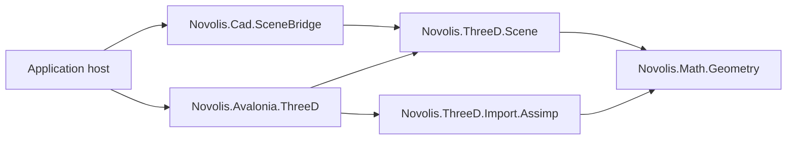

# ThreeD design

## Layer placement

`novolis-3d` is an Avalonia-free orthogonal library island. It may depend on
`Novolis.Math.Geometry` and third-party asset-format libraries. It must not
depend on Avalonia, rendering, Raylib, simulation, CAD, or application hosts.

## Package responsibilities

### `Novolis.ThreeD.Scene`

Owns the renderer-neutral scene document, hierarchy, transforms, mesh
instances, materials, lights, cameras, staged evaluation, editing state, and
`.nov3djson` serialization. Evaluation produces `Novolis.Math.Geometry`
values; it does not create GPU or renderer objects.

### `Novolis.ThreeD.Import.Assimp`

Owns translation from Assimp-supported external assets into Geometry meshes
and ThreeD-compatible skin data. It contains no UI or renderer policy.

### Geometry ownership

Mesh storage and algorithms remain in `Novolis.Math.Geometry`: booleans,
welding, splitting, topology, primitive tessellation, and geometric picking.
ThreeD composes those operations into a scene; it does not create a duplicate
mesh-algorithm façade.

## Document authority

Generic 3D products may author and persist `SceneDocument`. CAD and ship
products author `CadDocument` and derive a `SceneDocument` through
`Novolis.Cad.SceneBridge`. The CAD projection is one-way in this boundary;
scene-to-CAD round-tripping is not implied.

Renderer conversion belongs to a renderer-owned adapter or an application
composition root. The scene package must not contain renderer-shaped DTOs.
